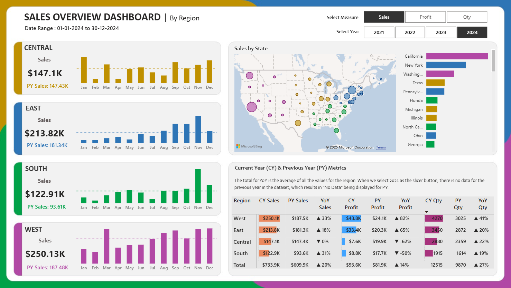

# 📊 Sales Overview Dashboard – Power BI Project  

## 📌 Project Overview  
This project demonstrates the design of an **interactive Power BI dashboard** to analyze and track **Sales, Profit, and Quantity** across four regions: **Central, East, South, and West**.  
The dashboard provides **Current Year (CY)** vs **Previous Year (PY)** comparisons and allows dynamic switching between metrics, enabling stakeholders to gain actionable business insights.  

---

## 🎯 Business Requirements  
- Track **Sales, Profit, and Quantity** by region with **year-based filters**.  
- Allow dynamic switching between **Sales, Profit, and Quantity**.  
- Show **Previous Year (PY)** alongside **Current Year (CY)** values.  
- Display **monthly trends** using sparklines with average lines.  
- Visualize **Sales by State** using:  
  - **Bubble Map** – geographic distribution of sales.  
  - **Bar Chart** – detailed breakdown of top/bottom states.  
- Create a **summary table** with:  
  - CY vs PY Sales and YoY%  
  - CY vs PY Profit and YoY%  
  - CY vs PY Quantity and YoY%  

---

## 🔧 Tools & Technologies  
- **Power BI Desktop** – Dashboard development  
- **Excel** – Data source  
- **Power Query** – Data cleaning & transformation  
- **DAX** – KPI calculations  

---

## 📂 Project Workflow  
1. **Requirement Gathering** – Identified KPIs and reporting needs.  
2. **Data Preparation** – Cleaned and transformed Excel data using Power Query.  
3. **Data Modeling** – Built relationships and measures.  
4. **DAX Calculations** – Created YoY and KPI metrics.  
5. **Dashboard Design** – Developed interactive visuals and layout.  
6. **Insights Generation** – Highlighted trends and regional performance.  

---

## 📸 Dashboard Preview  
  

---

## 📈 Key Insights  
- **West region** achieved the highest sales, contributing significantly to revenue.  
- **East region** recorded ~18% YoY sales growth.  
- **South region** reported the highest YoY profit growth (~50%).  
- Overall company performance showed a **20% YoY sales growth**.  

---

## 📎 Files in Repository  
- `Sales_Overview.pbix` → Power BI Dashboard  
- `Dataset.xlsx` → Source dataset  
- `Problem Statement.pptx` → Business requirements document  
- `Screenshots/` → Dashboard images  
- `README.md` → Documentation  

---

##  How to Use  
1. Clone or download this repository.  
2. Open `Sales_Overview.pbix` in **Power BI Desktop**.  
3. Use slicers to explore by year and switch between **Sales, Profit, Quantity**.  
4. Drill down into regions/states for deeper insights.  

---

## 📬 Author  
👤 **Pavan Kumar Eleti**  
- 📧 pavaneletisj@gmail.com  
- 🔗 [LinkedIn Profile]([www.linkedin.com/in/pavan-eleti-800a48305)  
- 🔗 [GitHub Profile](https://github.com/PAVANKUMARELETI)  

THANK YOU💗
---

✨ *This project highlights the use of Power BI for dynamic KPI tracking, business reporting, and visualization.*  
